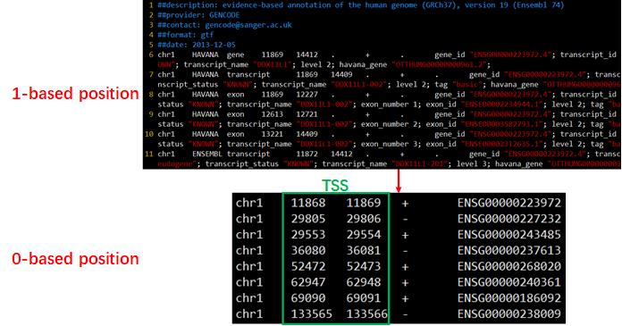

# ExPecto_Usage
Specification of how to use ExPecto to predict variant's effect on gene expression when applying to our own data
## Computes the chromatin effects of the variants, using trained convolutional neural network model
```
python chromatin.py ./example/example.vcf
```
The input file *example.vcf* is the standard vcf format. The separator is the table sign. The screenshot is as following.


## Computes predicted tissue-specific expression effects which takes predicted chromatin effects as input
```
python predict.py --coorFile ./example/example.vcf --geneFile ./example/example.vcf.bed.sorted.bed.closestgene --snpEffectFilePattern ./example/example.vcf.shift_SHIFT.diff.h5 --modelList ./resources/modellist --output output.csv
```
`--closestGeneFile ./example/example.vcf.bed.sorted.bed.closestgene` specifies the gene association file which decides for each variant the associated gene for which the expression effect is predicted. The screenshot is as following.


The content of the gene association file has to include the following information:

- The first column is the chromosome name.
- The second and third columns are the positions. (Obviously, it is 0-based position.)
- The fourth and fifth columns are the reference bases and alternative bases, respectively.
- The last three columns are the strand of the associated gene, the ENSEMBL gene id (matched with the gene annotation file `./resources/geneanno.csv`) and distance to the representative TSS of that gene (The distance should be signed and calculated as ''*TSS position* - *variant position*" regardless of on which strand the gene is transcribed.).

### How to get the TSS information of the corresponding genes

Download the gene annotation file `gencode.v19.annotation.gtf.gz` from [GENCODE](https://www.gencodegenes.org/human/release_19.html).



As we can see, the initial `gtf` file adopts 1-based position. According to the specification, it should be converted to 0-based position when extract the TSS information. Therefore, I wrote a python script `gene_strand.py`.

The initial `gtf` file is specified by variable `gencode19`; the output file is specified by variable `gencode19_cut`. Please note that the separator is also the table sign.


